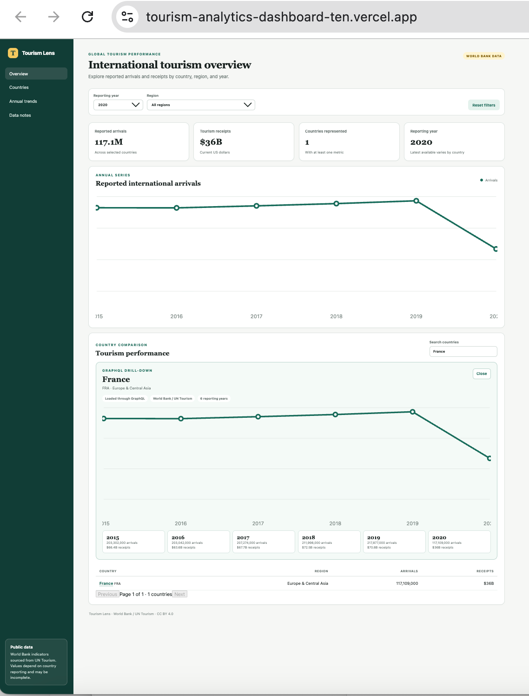

# Tourism Analytics Dashboard

An interactive portfolio dashboard for exploring international tourism arrivals and receipts by country, region, and year.

## Current status

The live React dashboard consumes a Django REST API backed by PostgreSQL on Azure. Country rows open a GraphQL-powered drill-down with each country's annual arrivals and receipts history.

**Live demo:** https://tourism-analytics-dashboard-ten.vercel.app/

## Demo

[](https://tourism-analytics-dashboard-ten.vercel.app/)

Search for a country and select its name to load annual arrivals and receipts through the GraphQL drill-down.

## Features

- Responsive KPI overview for reported arrivals, tourism receipts, and country coverage
- Interactive region and year controls
- Searchable source-market table
- Clickable country details loaded through GraphQL
- Annual arrivals trend visualization
- Accessible labels and mobile-friendly layout
- Django REST API with market, year, region, and text filters
- PostgreSQL-ready persistence with a local SQLite fallback
- Reproducible World Bank API ingestion command
- Docker Compose demo and GitHub Actions CI/CD
- Azure-hosted backend with health and readiness checks
- Backend API and frontend component tests

## Tech stack

- React
- TypeScript
- Vite
- CSS
- Django
- Django REST Framework
- Strawberry GraphQL
- PostgreSQL (configured through `DATABASE_URL`)
- Docker and GitHub Actions
- Azure Container Apps and Vercel

## Run locally

```bash
npm install
npm run dev
```

Then open the local URL shown by Vite.

### Backend

```bash
cd backend
python -m venv .venv
source .venv/bin/activate
pip install -r requirements.txt
python manage.py migrate
python manage.py runserver
```

Import the public dataset and start the API:

```bash
python manage.py import_world_bank --start-year 2015 --end-year 2023
python manage.py runserver
```

The API will be available at:

- `GET /api/health/`
- `GET /api/metrics/`
- `GET /api/metrics/?year=2020&region=Europe%20%26%20Central%20Asia&search=Germany`
- `POST /graphql/` with `country(code: "FRA")` for annual country history

SQLite is used when `DATABASE_URL` is not set. Copy `backend/.env.example` and provide a PostgreSQL connection string when running against PostgreSQL.

Run backend tests with:

```bash
cd backend
python manage.py test
```

## Build

```bash
npm run build
```

## Architecture

- Vercel serves the React/TypeScript frontend.
- Azure Container Apps runs the Dockerized Django API.
- Azure Database for PostgreSQL stores the imported tourism metrics.
- Django REST Framework powers dashboard filtering, summaries, trends, and pagination.
- GraphQL powers the country-level drill-down.
- GitHub Actions tests both applications, publishes the backend image to GHCR, and deploys it to Azure Container Apps after changes reach `main`.

## Data note

The ingestion pipeline uses World Bank indicators `ST.INT.ARVL` (international tourism arrivals) and `ST.INT.RCPT.CD` (international tourism receipts), sourced from UN Tourism and published under CC BY 4.0. Reporting coverage and the most recent year vary by country.

- [Arrivals indicator](https://data.worldbank.org/indicator/ST.INT.ARVL)
- [Receipts indicator](https://data.worldbank.org/indicator/ST.INT.RCPT.CD)
- [World Bank Indicators API documentation](https://datahelpdesk.worldbank.org/knowledgebase/articles/898581-api-basic-call-structures)
